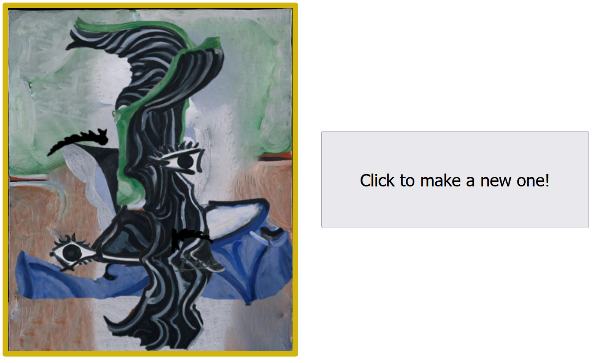
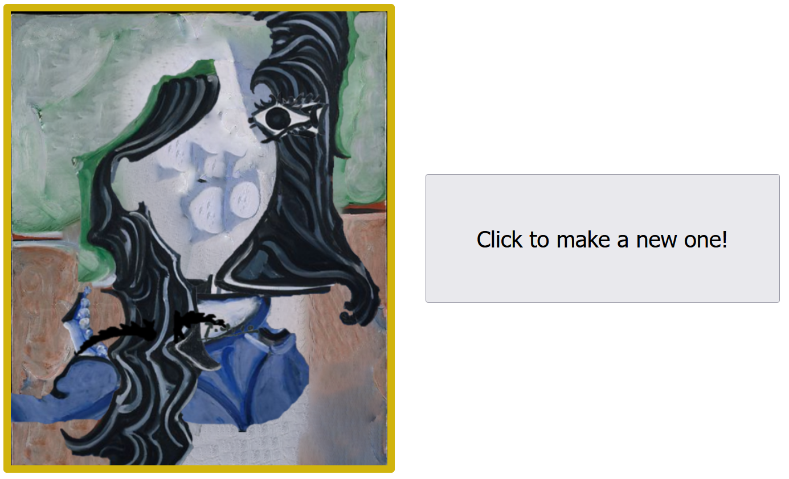

# Picasso
Sometimes, some works by Picasso look like he put the different features of the subject at random locations. In this silly little program, we literally put the different features at random locations, using a custom pseudo-random number generator. Occasionally we get interesting compositions. 

 

<a href="https://nialvo.github.io/Pablo/" target="_blank" >Visit page</a>
